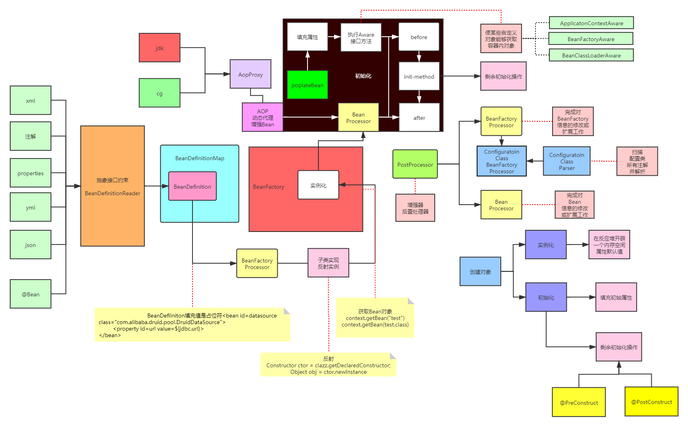

# IOC容器附图与源码详解



## Refresh方法

``` java
@Override
	public void refresh() throws BeansException, IllegalStateException {
		synchronized (this.startupShutdownMonitor) {
			// Prepare this context for refreshing.
			prepareRefresh();

			// Tell the subclass to refresh the internal bean factory.
			ConfigurableListableBeanFactory beanFactory = obtainFreshBeanFactory();

			// Prepare the bean factory for use in this context.
			prepareBeanFactory(beanFactory);

			try {
				// Allows post-processing of the bean factory in context subclasses.
				postProcessBeanFactory(beanFactory);

				// Invoke factory processors registered as beans in the context.
				invokeBeanFactoryPostProcessors(beanFactory);

				// Register bean processors that intercept bean creation.
				registerBeanPostProcessors(beanFactory);

				// Initialize message source for this context.
				initMessageSource();

				// Initialize event multicaster for this context.
				initApplicationEventMulticaster();

				// Initialize other special beans in specific context subclasses.
				onRefresh();

				// Check for listener beans and register them.
				registerListeners();

				// Instantiate all remaining (non-lazy-init) singletons.
				finishBeanFactoryInitialization(beanFactory);

				// Last step: publish corresponding event.
				finishRefresh();
			}

			catch (BeansException ex) {
				if (logger.isWarnEnabled()) {
					logger.warn("Exception encountered during context initialization - " +
							"cancelling refresh attempt: " + ex);
				}

				// Destroy already created singletons to avoid dangling resources.
				destroyBeans();

				// Reset 'active' flag.
				cancelRefresh(ex);

				// Propagate exception to caller.
				throw ex;
			}

			finally {
				// Reset common introspection caches in Spring's core, since we
				// might not ever need metadata for singleton beans anymore...
				resetCommonCaches();
			}
		}
	}
```

## BeanDefinitions反射实例化

``` java
protected Object doCreateBean(String beanName, RootBeanDefinition mbd, @Nullable Object[] args) throws BeanCreationException {
        BeanWrapper instanceWrapper = null;
        if (mbd.isSingleton()) {
            instanceWrapper = (BeanWrapper)this.factoryBeanInstanceCache.remove(beanName);
        }

        if (instanceWrapper == null) {
            instanceWrapper = this.createBeanInstance(beanName, mbd, args);
        }
        ......
```

``` java
protected BeanWrapper instantiateBean(String beanName, RootBeanDefinition mbd) {
        try {
            Object beanInstance;
            if (System.getSecurityManager() != null) {
                beanInstance = AccessController.doPrivileged(() -> {
                    return this.getInstantiationStrategy().instantiate(mbd, beanName, this);
                }, this.getAccessControlContext());
            } else {
                beanInstance = this.getInstantiationStrategy().instantiate(mbd, beanName, this);
            }
            ......
```

``` java
protected BeanWrapper instantiateBean(String beanName, RootBeanDefinition mbd) {
  ......
  beanInstance = this.getInstantiationStrategy().instantiate(mbd, beanName, this);
```

``` java
public Object instantiate(RootBeanDefinition bd, @Nullable String beanName, BeanFactory owner) {
  ......
  constructorToUse = clazz.getDeclaredConstructor();
```

``` java
public static <T> T instantiateClass(Constructor<T> ctor, Object... args) throws BeanInstantiationException{
  ......
  return ctor.newInstance(argsWithDefaultValues);
}
```

## 初始化填充值

``` java
 */
	@Override
	protected final void refreshBeanFactory() throws BeansException {
		if (hasBeanFactory()) {
			destroyBeans();
			closeBeanFactory();
		}
		try {
			DefaultListableBeanFactory beanFactory = createBeanFactory();
			beanFactory.setSerializationId(getId());
			customizeBeanFactory(beanFactory);
			loadBeanDefinitions(beanFactory);
			this.beanFactory = beanFactory;
		}
		catch (IOException ex) {
			throw new ApplicationContextException("I/O error parsing bean definition source for " + getDisplayName(), ex);
		}
	}
```

## 实现Aware接口

``` java
protected Object initializeBean(String beanName, Object bean, @Nullable RootBeanDefinition mbd) {
        if (System.getSecurityManager() != null) {
            AccessController.doPrivileged(() -> {
                this.invokeAwareMethods(beanName, bean);
                return null;
            }, this.getAccessControlContext());
        } else {
            this.invokeAwareMethods(beanName, bean);
        }
        .....
```

``` java
protected void populateBean(String beanName, RootBeanDefinition mbd, @Nullable BeanWrapper bw)
```

``` java
public Object applyBeanPostProcessorsBeforeInitialization(Object existingBean, String beanName) throws BeansException
```


